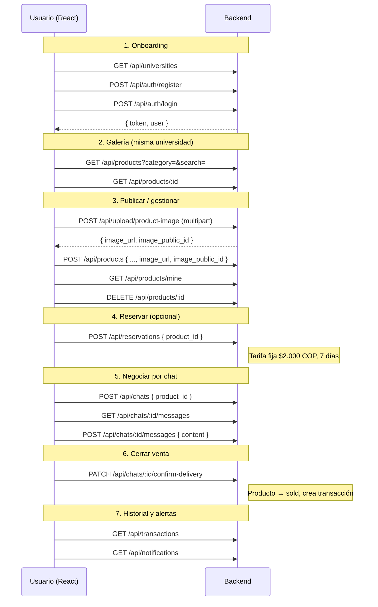

# Re-Pensa Tech — Guía de integración Frontend (React + TypeScript)

Documentación para conectar el frontend con el backend. Base URL local por defecto:

```
http://localhost:3000
```

Todas las rutas de negocio viven bajo el prefijo `/api`, excepto el health check.

---

## Configuración rápida

### Variables de entorno sugeridas (React / Vite)

```env
VITE_API_URL=http://localhost:3000/api
```

### Headers comunes

| Header | Cuándo usarlo |
|--------|---------------|
| `Content-Type: application/json` | En todos los `POST`, `PATCH` con body |
| `Authorization: Bearer <token>` | En rutas protegidas (casi todo excepto registro, login y listar universidades) |

### Formato de errores

El backend responde errores con un JSON simple:

```ts
interface ApiError {
  message: string;
}
```

Códigos habituales: `400` (validación/regla de negocio), `401` (sin token o token inválido), `403` (sin permiso), `404` (recurso no encontrado), `500` (error interno).

### Fechas

Los campos `created_at`, `updated_at`, `expires_at`, `confirmed_at`, etc. llegan como **strings ISO 8601** en JSON (ej. `"2026-05-28T10:30:00.000Z"`). En el frontend tiparlos como `string` o `Date` según prefieran parsear.

### CORS

El backend tiene CORS habilitado. Por defecto acepta peticiones desde:

- `http://localhost:5173` (Vite)
- `http://127.0.0.1:5173`

Para agregar más orígenes (staging, producción), configurar en el `.env` del backend:

```env
CORS_ORIGIN=http://localhost:5173,https://app.repensatech.com
```

Los orígenes se separan por coma. Postman y `curl` siguen funcionando (no envían header `Origin`).

El frontend puede llamar directamente a `VITE_API_URL` sin proxy en Vite.

---

## Autenticación

- El login devuelve un **JWT** con vigencia de **7 días**.
- Guardar el token en `localStorage`, `sessionStorage` o estado global (React Context, Zustand, etc.).
- El payload del token incluye: `userId`, `universityId`, `role` (`student` | `admin`).
- No existe endpoint de refresh; cuando expire el token, redirigir a login.

### Rutas públicas (sin token)

| Método | Ruta |
|--------|------|
| `GET` | `/health` |
| `GET` | `/api/universities` |
| `POST` | `/api/auth/register` |
| `POST` | `/api/auth/login` |

### Rutas solo admin

Requieren token + `role === 'admin'`:

| Método | Ruta |
|--------|------|
| `POST` | `/api/universities` |
| `PATCH` | `/api/universities/:id/status` |

---

## Flujo de negocio



### Reglas importantes para la UI

1. **Galería**: `GET /api/products` solo muestra productos `available` de la **misma universidad** del usuario logueado.
2. **Reserva**: bloquea el producto (`reserved`) por 7 días. Tarifa: **$2.000 COP**. Si expira sin confirmar entrega, vuelve a `available`.
3. **Chat**: un comprador solo puede abrir un chat por producto. El vendedor no puede chatear sobre su propio producto.
4. **Confirmar entrega**: comprador o vendedor pueden hacerlo. Cierra el chat, marca el producto como `sold` y crea una entrada en `/api/transactions`.
5. **Publicar producto**: primero `POST /api/upload/product-image`, luego `POST /api/products` con la URL devuelta.
6. **Eliminar producto**: solo el dueño y solo si está `available` (borra imagen en Cloudinary si hay `image_public_id`).

---

## Interfaces TypeScript

Copiar a `src/types/api.ts` (o similar) en el proyecto React.

```ts
// ── Enums / unions ──────────────────────────────────────────

export type UserRole = 'student' | 'admin';

export type ProductCondition = 'new' | 'good' | 'regular';
export type ProductStatus = 'available' | 'reserved' | 'sold';
export type ProductCategory =
  | 'microcontrollers'
  | 'sensors'
  | 'memory'
  | 'displays'
  | 'cables'
  | 'power'
  | 'other';

export type ChatStatus = 'open' | 'delivery_confirmed';

export type ReservationStatus = 'active' | 'completed' | 'expired';

export type SubscriptionStatus = 'active' | 'inactive' | 'expired';

export type NotificationType =
  | 'reservation_confirmed'
  | 'reservation_expiring'
  | 'reservation_expired'
  | 'product_approved'
  | 'new_message'
  | 'new_interested'
  | 'sale_completed'
  | 'purchase_completed'
  | 'admin_published';

export type NotificationRef = 'product' | 'chat' | 'reservation' | 'transaction';

export type TransactionDirection = 'purchase' | 'sale';

// ── Entidades ───────────────────────────────────────────────

export interface User {
  id: string;
  university_id: string;
  full_name: string;
  email: string;
  role: UserRole;
  created_at: string;
  updated_at: string;
}

export interface University {
  id: string;
  name: string;
  email_domain: string;
  subscription_status: SubscriptionStatus;
  subscription_start: string;
  subscription_end: string;
  created_at: string;
  updated_at: string;
}

export interface Product {
  id: string;
  seller_id: string;
  university_id: string;
  name: string;
  description: string | null;
  price: number;
  is_donation: boolean;
  category: ProductCategory;
  condition: ProductCondition;
  status: ProductStatus;
  image_url: string;
  image_public_id: string | null;
  created_at: string;
  updated_at: string;
  /** Presente en galería y detalle */
  seller_name?: string;
  /** Solo en detalle */
  seller_email?: string;
}

export interface Chat {
  id: string;
  product_id: string;
  buyer_id: string;
  seller_id: string;
  status: ChatStatus;
  created_at: string;
  updated_at: string;
  /** En listado y detalle */
  product_name?: string;
  product_price?: number;
  product_image?: string | null;
  buyer_name?: string;
  seller_name?: string;
  buyer_university_name?: string;
  seller_university_name?: string;
  /** Solo en listado */
  last_message?: string | null;
  last_message_at?: string | null;
}

export type MessageType = 'text' | 'appointment';

export interface Message {
  id: string;
  chat_id: string;
  sender_id: string;
  type: MessageType;
  content: string;
  created_at: string;
  sender_name?: string;
}

export interface AppointmentPayload {
  day: string;
  time: string;
  location: string;
}

export interface Reservation {
  id: string;
  product_id: string;
  buyer_id: string;
  fee_paid: number;
  status: ReservationStatus;
  expires_at: string;
  created_at: string;
  product_name?: string;
  product_image?: string | null;
  product_price?: number;
}

export interface Transaction {
  id: string;
  product_id: string;
  seller_id: string;
  buyer_id: string;
  chat_id: string;
  reservation_id: string | null;
  final_price: number;
  confirmed_at: string;
  created_at: string;
  product_name?: string;
  product_image?: string | null;
  product_category?: ProductCategory;
  buyer_name?: string;
  seller_name?: string;
  direction?: TransactionDirection;
}

export interface Notification {
  id: string;
  user_id: string;
  type: NotificationType;
  title: string;
  description: string | null;
  is_read: boolean;
  reference_id: string | null;
  reference_type: NotificationRef | null;
  created_at: string;
}

// ── Request bodies ──────────────────────────────────────────

export interface RegisterRequest {
  university_id: string;
  full_name: string;
  email: string;
  password: string; // mínimo 8 caracteres
}

export interface LoginRequest {
  email: string;
  password: string;
}

export interface UploadProductImageResponse {
  image_url: string;
  image_public_id: string;
  width: number;
  height: number;
}

export interface CreateProductRequest {
  name: string;
  description?: string;
  price: number;
  is_donation: boolean;
  category: ProductCategory;
  condition: ProductCondition;
  image_url: string;
  image_public_id?: string;
}

export interface OpenChatRequest {
  product_id: string;
}

export interface SendMessageRequest {
  content?: string;
  type?: MessageType;
  appointment?: AppointmentPayload;
}

export interface ReserveProductRequest {
  product_id: string;
}

export interface CreateUniversityRequest {
  name: string;
  email_domain: string;
  subscription_start: string; // "YYYY-MM-DD"
  subscription_end: string;
}

export interface UpdateUniversityStatusRequest {
  status: SubscriptionStatus;
}

// ── Responses ───────────────────────────────────────────────

export interface HealthResponse {
  status: 'ok';
}

export interface RegisterResponse {
  message: string;
  user: User;
}

export interface LoginResponse {
  token: string;
  user: User;
}

export interface MessageResponse {
  message: string;
}

export interface NotificationsResponse {
  unread: number;
  notifications: Notification[];
}

export interface ProductFilters {
  category?: ProductCategory;
  condition?: ProductCondition;
  is_donation?: boolean;
  search?: string;
}
```

---

## Endpoints

### Health

#### `GET /health` — Público

**Response `200`**

```json
{ "status": "ok" }
```

---

### Universidades

#### `GET /api/universities` — Público

Lista universidades para el selector del formulario de registro.

**Response `200`**: `University[]`

---

#### `POST /api/universities` — Admin

**Body**: `CreateUniversityRequest`

**Response `201`**: `University`

**Errores**: `400` dominio duplicado, campos faltantes.

---

#### `PATCH /api/universities/:id/status` — Admin

**Body**: `UpdateUniversityStatusRequest`

**Response `200`**: `University`

---

### Autenticación

#### `POST /api/auth/register` — Público

**Body**: `RegisterRequest`

Validaciones:
- El dominio del email debe coincidir con `email_domain` de la universidad elegida.
- La universidad debe tener `subscription_status === 'active'`.
- Contraseña mínimo 8 caracteres.

**Response `201`**: `RegisterResponse`

> El registro **no** devuelve token. Después del registro, llamar a login o redirigir al login.

---

#### `POST /api/auth/login` — Público

**Body**: `LoginRequest`

**Response `200`**: `LoginResponse`

```json
{
  "token": "eyJhbGciOiJIUzI1NiIs...",
  "user": {
    "id": "uuid",
    "university_id": "uuid",
    "full_name": "María Rodríguez",
    "email": "maria@uniempresarial.edu.co",
    "role": "student",
    "created_at": "...",
    "updated_at": "..."
  }
}
```

---

### Upload de imágenes (Cloudinary) — Requiere token

Las imágenes **no** se envían en `POST /api/products`. Primero subes el archivo al backend; este lo aloja en Cloudinary y devuelve la URL.

#### `POST /api/upload/product-image`

**Content-Type**: `multipart/form-data`

| Campo | Tipo | Requerido |
|-------|------|-----------|
| `image` | archivo | sí |

**Límites**: máx. 5 MB. Formatos: JPG, PNG, WEBP, GIF.

**Response `201`**: `UploadProductImageResponse`

```json
{
  "image_url": "https://res.cloudinary.com/tu-cloud/image/upload/v123/repensa/products/abc.jpg",
  "image_public_id": "repensa/products/abc",
  "width": 800,
  "height": 600
}
```

Usar `image_url` e `image_public_id` en el body de `POST /api/products`. El backend solo acepta URLs de tu cuenta Cloudinary (`CLOUDINARY_CLOUD_NAME`).

---

### Productos — Requiere token

#### `GET /api/products`

Galería de la universidad del usuario. Solo productos `available`.

**Query params** (todos opcionales):

| Param | Tipo | Ejemplo |
|-------|------|---------|
| `category` | `ProductCategory` | `microcontrollers` |
| `condition` | `ProductCondition` | `new` |
| `is_donation` | `boolean` | `true` |
| `search` | `string` | `arduino` |

**Response `200`**: `Product[]` (incluye `seller_name`)

---

#### `GET /api/products/mine`

Productos publicados por el usuario (cualquier estado).

**Response `200`**: `Product[]`

---

#### `GET /api/products/:id`

**Response `200`**: `Product` (incluye `seller_name`, `seller_email`)

**Response `404`**: producto no encontrado.

---

#### `POST /api/products`

**Body**: `CreateProductRequest`

Flujo obligatorio:

1. `POST /api/upload/product-image` con el archivo.
2. `POST /api/products` con los datos del producto + `image_url` (+ `image_public_id` recomendado).

Si `is_donation === true`, el backend fuerza `price` a `0`.

**Response `201`**: `Product`

**Errores `400`**: imagen faltante, URL que no pertenece a tu Cloudinary.

---

#### `DELETE /api/products/:id`

Solo dueño + estado `available`. Si el producto tiene `image_public_id`, el backend también elimina la imagen en Cloudinary.

**Response `200`**: `{ "message": "Producto eliminado" }`

---

### Chats — Requiere token

#### `GET /api/chats`

Lista conversaciones del usuario (como comprador o vendedor).

**Response `200`**: `Chat[]`

---

#### `GET /api/chats/:id`

Detalle de un chat. Solo participantes.

**Response `200`**: `Chat`

**Response `404`**: no encontrado o sin acceso.

---

#### `POST /api/chats`

Abre chat con el vendedor del producto. Si ya existe, devuelve el existente.

**Body**: `OpenChatRequest`

**Response `201`**: `Chat`

---

#### `GET /api/chats/:id/messages`

**Response `200`**: `Message[]` (orden cronológico, incluye `sender_name`)

**Response `403`**: sin acceso.

---

#### `POST /api/chats/:id/messages`

**Body** (`SendMessageRequest`):

Mensaje de texto:

```json
{ "content": "Hola", "type": "text" }
```

Encuentro acordado:

```json
{
  "type": "appointment",
  "appointment": {
    "day": "Miércoles",
    "time": "2:00 PM",
    "location": "Bloque E"
  }
}
```

**Response `201`**: `Message` (incluye `type`: `text` | `appointment`)

No permite enviar si el chat ya tiene `status === 'delivery_confirmed'`.

---

#### `PATCH /api/chats/:id/confirm-delivery`

Confirma entrega. Comprador o vendedor.

**Response `200`**

```json
{
  "message": "Entrega confirmada. Transacción registrada en el historial."
}
```

---

### WebSockets (socket.io) — Chat en vivo

**URL**: mismo host que la API (en dev con Vite: proxy `/socket.io` → backend).

**Autenticación** (handshake):

```ts
io(WS_URL, { auth: { token: '<JWT>' } });
```

**Eventos cliente → servidor**

| Evento | Payload | Descripción |
|--------|---------|-------------|
| `chat:join` | `chatId` | Unirse a la sala del chat activo |
| `chat:leave` | `chatId` | Salir de la sala |

**Eventos servidor → cliente**

| Evento | Payload | Descripción |
|--------|---------|-------------|
| `message:new` | `Message` | Nuevo mensaje en el chat |
| `chat:updated` | `{ id, status, last_message?, last_message_at? }` | Actualiza preview del sidebar |
| `chat:delivery_confirmed` | `{ chatId, status }` | Entrega confirmada |

---

### Reservas — Requiere token

#### `GET /api/reservations`

Reservas del usuario autenticado.

**Response `200`**: `Reservation[]`

---

#### `POST /api/reservations`

**Body**: `ReserveProductRequest`

**Response `201`**: `Reservation`

```json
{
  "id": "uuid",
  "product_id": "uuid",
  "buyer_id": "uuid",
  "fee_paid": 2000,
  "status": "active",
  "expires_at": "2026-06-11T00:00:00.000Z",
  "created_at": "..."
}
```

---

### Transacciones (historial) — Requiere token

#### `GET /api/transactions`

Historial de compras y ventas del usuario.

**Response `200`**: `Transaction[]`

Cada item incluye `direction`: `"purchase"` si el usuario fue comprador, `"sale"` si fue vendedor.

---

### Notificaciones — Requiere token

#### `GET /api/notifications`

**Response `200`**: `NotificationsResponse`

```json
{
  "unread": 2,
  "notifications": [ /* Notification[] — últimas 50 */ ]
}
```

Usar `reference_type` + `reference_id` para navegar al detalle (producto, chat, etc.).

---

#### `PATCH /api/notifications/read-all`

**Response `200`**: `{ "message": "Notificaciones marcadas como leídas" }`

---

#### `PATCH /api/notifications/:id/read`

**Response `200`**: `{ "message": "Notificación marcada como leída" }`

---

## Cliente API de ejemplo (React + fetch)

```ts
// src/lib/api.ts
const API_URL = import.meta.env.VITE_API_URL ?? 'http://localhost:3000/api';

function getToken(): string | null {
  return localStorage.getItem('token');
}

async function request<T>(
  path: string,
  options: RequestInit = {},
  auth = true
): Promise<T> {
  const headers: HeadersInit = {
    'Content-Type': 'application/json',
    ...(options.headers ?? {}),
  };

  if (auth) {
    const token = getToken();
    if (token) {
      (headers as Record<string, string>)['Authorization'] = `Bearer ${token}`;
    }
  }

  const res = await fetch(`${API_URL}${path}`, { ...options, headers });

  if (!res.ok) {
    const err = await res.json().catch(() => ({ message: res.statusText }));
    throw new Error(err.message ?? 'Error en la petición');
  }

  if (res.status === 204) return undefined as T;
  return res.json() as Promise<T>;
}

// ── Auth ────────────────────────────────────────────────────

export const api = {
  health: () =>
    fetch('http://localhost:3000/health').then((r) => r.json()),

  getUniversities: () =>
    request<University[]>('/universities', {}, false),

  register: (body: RegisterRequest) =>
    request<RegisterResponse>('/auth/register', {
      method: 'POST',
      body: JSON.stringify(body),
    }, false),

  login: async (body: LoginRequest) => {
    const data = await request<LoginResponse>('/auth/login', {
      method: 'POST',
      body: JSON.stringify(body),
    }, false);
    localStorage.setItem('token', data.token);
    return data;
  },

  logout: () => localStorage.removeItem('token'),

  // ── Products ──────────────────────────────────────────────

  getProducts: (filters?: ProductFilters) => {
    const params = new URLSearchParams();
    if (filters?.category) params.set('category', filters.category);
    if (filters?.condition) params.set('condition', filters.condition);
    if (filters?.is_donation !== undefined) {
      params.set('is_donation', String(filters.is_donation));
    }
    if (filters?.search) params.set('search', filters.search);
    const qs = params.toString();
    return request<Product[]>(`/products${qs ? `?${qs}` : ''}`);
  },

  getMyProducts: () => request<Product[]>('/products/mine'),

  getProduct: (id: string) => request<Product>(`/products/${id}`),

  uploadProductImage: (file: File) => {
    const formData = new FormData();
    formData.append('image', file);
    const token = getToken();
    return fetch(`${API_URL}/upload/product-image`, {
      method: 'POST',
      headers: token ? { Authorization: `Bearer ${token}` } : {},
      body: formData,
    }).then(async (res) => {
      if (!res.ok) {
        const err = await res.json().catch(() => ({ message: res.statusText }));
        throw new Error(err.message ?? 'Error al subir imagen');
      }
      return res.json() as Promise<UploadProductImageResponse>;
    });
  },

  createProduct: (body: CreateProductRequest) =>
    request<Product>('/products', { method: 'POST', body: JSON.stringify(body) }),

  /** Flujo completo: sube imagen y publica producto */
  publishProduct: async (
    file: File,
    data: Omit<CreateProductRequest, 'image_url' | 'image_public_id'>
  ) => {
    const image = await api.uploadProductImage(file);
    return api.createProduct({ ...data, image_url: image.image_url, image_public_id: image.image_public_id });
  },

  deleteProduct: (id: string) =>
    request<MessageResponse>(`/products/${id}`, { method: 'DELETE' }),

  // ── Chats ───────────────────────────────────────────────

  getChats: () => request<Chat[]>('/chats'),

  getChat: (id: string) => request<Chat>(`/chats/${id}`),

  openChat: (product_id: string) =>
    request<Chat>('/chats', {
      method: 'POST',
      body: JSON.stringify({ product_id }),
    }),

  getMessages: (chatId: string) =>
    request<Message[]>(`/chats/${chatId}/messages`),

  sendMessage: (chatId: string, content: string) =>
    request<Message>(`/chats/${chatId}/messages`, {
      method: 'POST',
      body: JSON.stringify({ content, type: 'text' }),
    }),

  sendAppointment: (chatId: string, appointment: AppointmentPayload) =>
    request<Message>(`/chats/${chatId}/messages`, {
      method: 'POST',
      body: JSON.stringify({ type: 'appointment', appointment }),
    }),

  confirmDelivery: (chatId: string) =>
    request<MessageResponse>(`/chats/${chatId}/confirm-delivery`, {
      method: 'PATCH',
    }),

  // ── Reservations ────────────────────────────────────────

  getReservations: () => request<Reservation[]>('/reservations'),

  reserveProduct: (product_id: string) =>
    request<Reservation>('/reservations', {
      method: 'POST',
      body: JSON.stringify({ product_id }),
    }),

  // ── Transactions ──────────────────────────────────────

  getTransactions: () => request<Transaction[]>('/transactions'),

  // ── Notifications ─────────────────────────────────────

  getNotifications: () => request<NotificationsResponse>('/notifications'),

  markAllNotificationsRead: () =>
    request<MessageResponse>('/notifications/read-all', { method: 'PATCH' }),

  markNotificationRead: (id: string) =>
    request<MessageResponse>(`/notifications/${id}/read`, { method: 'PATCH' }),
};
```

---

## Pantallas sugeridas y endpoints

| Pantalla | Endpoints principales |
|----------|----------------------|
| Registro | `GET /universities`, `POST /auth/register` |
| Login | `POST /auth/login` |
| Home / Galería | `GET /products` (+ filtros en query) |
| Detalle producto | `GET /products/:id` |
| Publicar producto | `POST /upload/product-image` → `POST /products` |
| Mis publicaciones | `GET /products/mine`, `DELETE /products/:id` |
| Mis reservas | `GET /reservations`, `POST /reservations` |
| Lista de chats | `GET /chats` |
| Chat en vivo | `GET /chats/:id`, `GET/POST .../messages`, `PATCH .../confirm-delivery` |
| Historial | `GET /transactions` |
| Notificaciones | `GET /notifications`, `PATCH /notifications/...` |
| Panel admin | `POST /universities`, `PATCH /universities/:id/status` |

---

## Colección Postman

Para pruebas manuales, importar `repensa-postman-collection.json` en la raíz del repo. El login guarda automáticamente la variable `token` en la colección.

---

## Base de datos y seed

Al arrancar el servidor (`npm run dev`), `initDatabase()`:

1. Ejecuta `db/schema.sql` si no existen tablas.
2. Aplica migraciones idempotentes (ej. columna `image_public_id`).
3. Ejecuta `db/seed.sql` **solo si** la tabla `universities` está vacía.

### Datos de prueba (seed)

| Recurso | Valor |
|---------|-------|
| Universidad | Universitaria Empresarial (`uniempresarial.edu.co`) |
| Estudiante | `maria.rodriguez@uniempresarial.edu.co` / `Estudiante1!` |
| Estudiante | `carlos.mendoza@uniempresarial.edu.co` / `Estudiante1!` |
| Admin | `admin@uniempresarial.edu.co` / `Admin1!` |
| Productos demo | Arduino Uno R3, Sensor HC-SR04 (imágenes de cuenta demo Cloudinary) |

Para recargar el seed en desarrollo: vaciar tablas o recrear la base `repensa`.

### Variables Cloudinary (backend `.env`)

```env
CLOUDINARY_CLOUD_NAME=tu_cloud
CLOUDINARY_API_KEY=...
CLOUDINARY_API_SECRET=...
```

Sin estas variables, `POST /api/upload/product-image` responde error. El resto de la API sigue funcionando.

---

## Checklist de integración

- [ ] Configurar `VITE_API_URL=http://localhost:3000/api`
- [ ] Implementar login y persistir `token`
- [ ] Enviar `Authorization: Bearer` en rutas protegidas
- [ ] Manejar `401` → logout y redirect a login
- [ ] En registro, cargar universidades antes del formulario
- [ ] Validar email con dominio de la universidad seleccionada (UX; el backend también valida)
- [ ] Mostrar estados de producto: `available` | `reserved` | `sold`
- [ ] Polling o refresh manual en chats y notificaciones (no hay WebSockets aún)
- [ ] Flujo publicar: `uploadProductImage` → `createProduct` con `image_url` + `image_public_id`
- [ ] Formulario multipart: campo `image` (no base64 en JSON)
